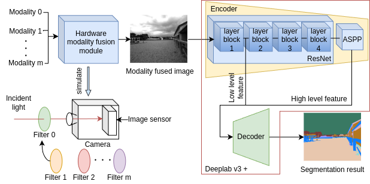
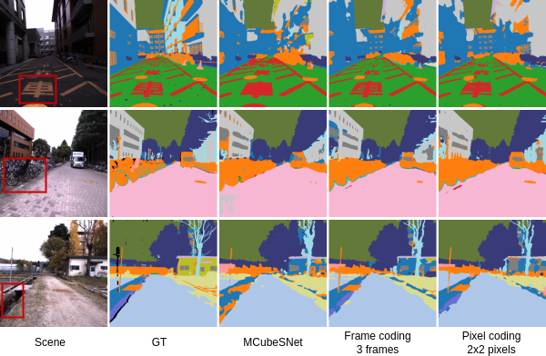
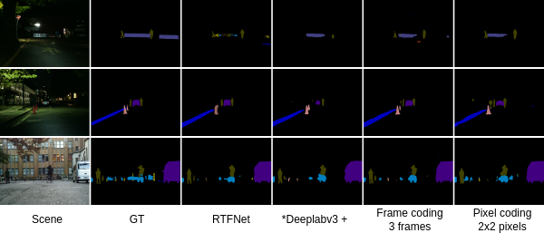

# Deep Hardware Modality Fusion for Image Segmentation, ICPR 2024

This is the official implementation of Deep Hardware Modality Fusion for Image Segmentation, ICPR 2024. For paper details, please check [here](https://link.springer.com/chapter/10.1007/978-3-031-78183-4_28).

If you find our work helps, please consider citing our paper:<br>
```
@inproceedings{liu2025deep,
  title={Deep Hardware Modality Fusion for Image Segmentation},
  author={Liu, Yi and Kumawat, Sudhakar and Nagahara, Hajime},
  booktitle={International Conference on Pattern Recognition},
  pages={439--454},
  year={2025},
  organization={Springer}
}
```

## Overall Structure


## Prepare
### 1. Clone the code
`git clone https://github.com/eki-1996/Deep_Hardware_Modality_Fusion`
### 2. Download dataset
MCubeS dataset: Download from [here](https://drive.google.com/file/d/14egTCyC0Pampb7imrXVwaDRffHN7FZxh/view?usp=sharing).<br>
RGB-Thermal dataset: Download from [here](http://gofile.me/4jm56/CfukComo1).

**Move** above datasets to ./datasets folder and **rename** RGB-Thermal dataset from "dataset" to "rgb_thermal_dataset".

### 3. Build virtual environment (Using anaconda)
First, move the code folder<br> `cd Deep_Hardware_Modality_Fusion`<br> And then, create the virtual environment<br>
`conda env create -f environment.yml`

### 4. Activate virtual environment
`conda activate hard_fusion`

### 5. Reconstruct polarization images for MCubeS dataset.
`python reconstract_4_polarization_image.py`


## Training and testing
### 1. Training model
Training hyperparameter explaining:<br>
input-channels-list: A string that lists each modality channel, connected by `,`. For example, `3,1,1,1,1,1` or `3,1`<br>
dataset: Which dataset to use. For example, `multimodal_dataset` or `rgb_thermal_dataset`<br>
dataset-modality: A string that lists each modality of the dataset, connected by `,`. For example, `rgb,aolp,dolp,nir,image_000,image_045,image_090,image_135` or `rgb,thermal`. **Note**: The order of modalities needs to match the order of the modality channels.<br>
use-modality: Which modalities to use. For example, `rgb,nir,image_000,image_045,image_090,image_135`. **Note**: Each modality of the use-modality must be contained in dataset-modality.<br>
use-hardware-modality-fusion: Use hardware modality fusion or not. Giving the parameter means using.<br> 
fusion-kernel-size: The kernel size of pixel block. `1` means frame coding, any value `>1` means pixel coding. **Note**: The kernel size should be dividable by the input image size, and `1` or `2` or `4` or `8` is used in our paper.<br>
fused-out-dim: The channel number of modality fused image. **Note**: The channel number should be `<=3` to fully utilize pretrained ResNet, and `1` or `3` is used in our paper.

Training the model:<br>
`sh main_train.sh`<br>


### 2. Testing model
Most of the hyperparameters are the same with training except `pth-path`.
pth-path: The saved model path for testing.

Testing the model:<br>
`sh main_test.sh`<br>

## Paper results
### 1. Result on MCubeS dataset


### 2. Result on RGB-Thermal dataset


## Pretrained model in our paper
Here, we only provide the 3c frame coding and 2x2 pixel coding pretrained model for each dataset.

### 1. MCubeS dataset
Download pretrained models from [here](https://drive.google.com/drive/u/0/folders/11PzuTl3hWkTiFoS5qU9jUoTOAX814SJH).
### 2. RGB-Thermal dataset
Download pretrained models from [here](https://drive.google.com/drive/u/0/folders/1Kwiaoh64Fat_KmU2Kq95tAb5nNsta0vF).

## Acknowledgements
This code is based on [MCubeSNet](https://github.com/kyotovision-public/multimodal-material-segmentation) and [RTFNet](https://github.com/yuxiangsun/RTFNet).

## References
1. Liang, Yupeng, et al. "Multimodal material segmentation." Proceedings of the IEEE/CVF Conference on Computer Vision and Pattern Recognition. 2022.<br>
2. Sun, Yuxiang, Weixun Zuo, and Ming Liu. "RTFNet: RGB-thermal fusion network for semantic segmentation of urban scenes." IEEE Robotics and Automation Letters 4.3 (2019): 2576-2583.

## Contact
If you have any questions, please contact my email: liuyi@is.ids.osaka-u.ac.jp
